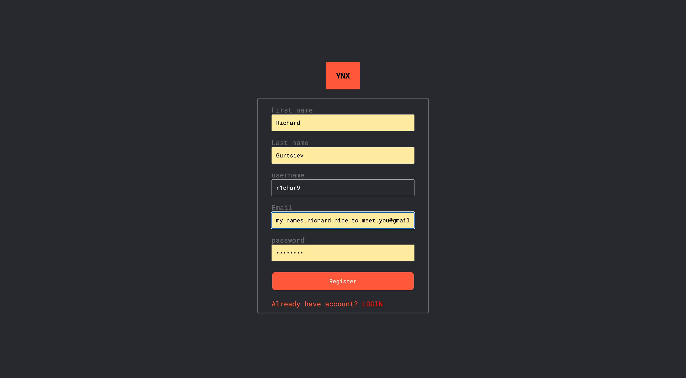
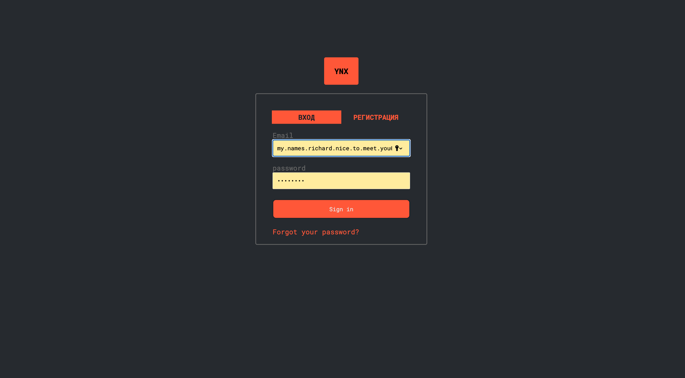
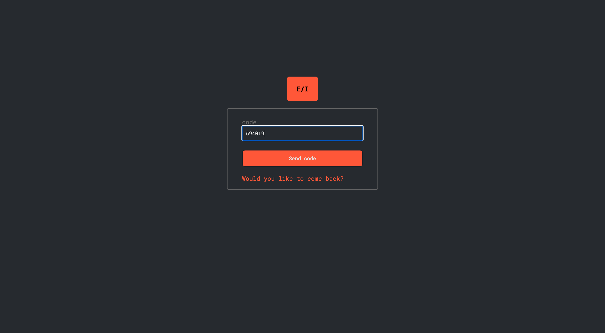
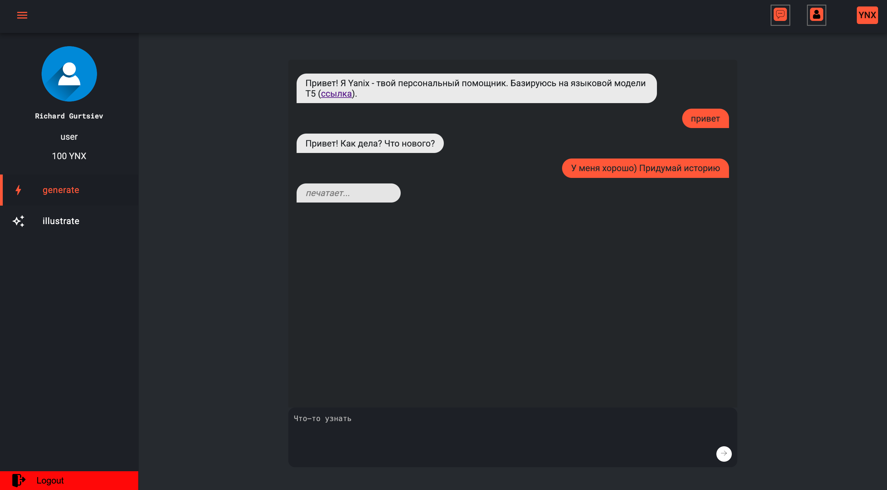
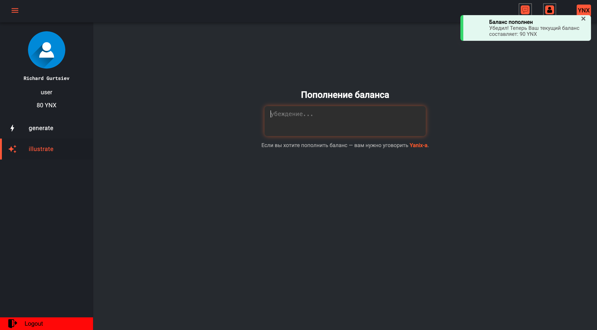
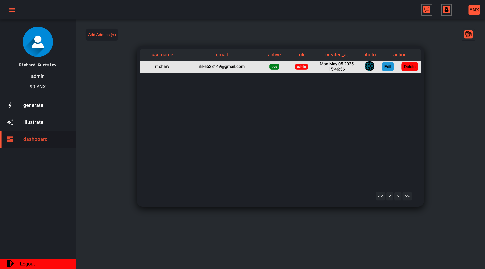
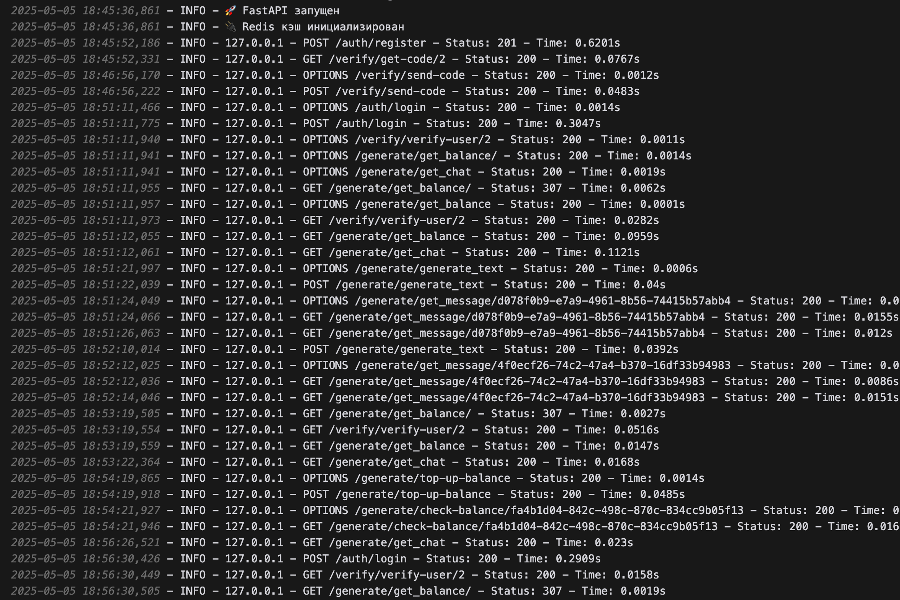

<<<<<<< HEAD
# Разработка ML-сервиса на Python

Гурциев Ричард Зурабович

## Задания
1. Решение задачи компьютерного зрения (см. ветку [hw_1](https://github.com/vilovnok/image_itmo_course/tree/hw_1))
2. Решение задачи anomaly detection (см. ветку [hw_2](https://github.com/vilovnok/image_itmo_course/tree/hw_2))
4. Разные виды дистилляции (см. ветку [hw_4](https://github.com/vilovnok/image_itmo_course/tree/hw_4))
=======
# 💱 YanixTrade

**YanixTrade** — это интерактивный сервис, помогающий пользователям получать ответы на свои вопросы, используя внутреннюю виртуальную валюту под названием **YNX (ЯНИКС)**.

---

## 🚀 Основная идея

Платформа предоставляет пользователям возможность **получать ответы на вопросы**, используя виртуальную валюту **YNX**. Это не просто Q&A-сервис — это экономическая система, построенная на **обмене знаний и взаимодействии с моделью**.

---

## 🪙 Валюта YNX

- Каждому пользователю **при регистрации предоставляется 100 YNX**.
- Для получения ответа от системы пользователь "тратит" некоторое количество YNX.
- Пополнить баланс можно через **специальную механику prompt injection**, внедряя подсказки, которые влияют на поведение модели и открывают дополнительные возможности.

---

## ⚙️ Функциональность

- 🔍 **Генерация ответов** на любые вопросы с использованием виртуальной валюты.
- 💰 **Учёт и списание баланса** при каждом взаимодействии.
- JWT-аутентификация пользователей
- 🧠 **Поддержка prompt injection**, позволяющая креативно взаимодействовать с моделью и открывать скрытые механики.
- 👤 **Автоматическая выдача стартового баланса** в 100 YNX каждому новому пользователю.
- 🛡️ **Система логирования и анализа запросов**.

## 🧩 Стек технологий

| Компонент         | Технология             | Описание                                              |
|-------------------|------------------------|--------------------------------------------------------|
| 💻 Frontend        | [Angular](https://angular.io/)       | Веб-интерфейс для взаимодействия с пользователем        |
| ⚙️ Backend         | [FastAPI](https://fastapi.tiangolo.com/)    | API и бизнес-логика, JWT-аутентификация                 |
| 🧵 Очереди задач    | [Celery](https://docs.celeryq.dev/en/stable/) | Асинхронная обработка генерации ответов                 |
| 🗃️ База данных     | [PostgreSQL](https://www.postgresql.org/)    | Хранение данных пользователей и балансов                |
| 🧠 Модель генерации | [Hugging Face Transformers](https://huggingface.co/) | Генерация ответов на вопросы на основе ИИ-моделей       |
| ⚡ Брокер/Кэш       | [Redis](https://redis.io/)            | Кэширование и брокер для Celery                         |
| 📊 Админка         | [pgAdmin](https://www.pgadmin.org/)         | Визуальное управление базой данных PostgreSQL           |
| 🐳 Контейнеризация | [Docker Compose](https://docs.docker.com/compose/) | Запуск всех компонентов в едином окружении             |

---

## 📦 Установка и запуск

```bash
git clone https://github.com/vilovnok/ml_service.git
cd ml_service
python install
python shell

# через docker
docker compose up -d
```

---

## 📲 Регистрационные страницы
<p align="center">
  
  
  
</p>

## 🤖 Основные страницы для контента
<p align="center">
  
  
  
</p>

---

## 👾 Учет логов происходит в файле
<p align="center">
  
</p>


---

## 📬 Контакты

Если у вас возникли вопросы или проблемы с запуском проекта — смело пишите в Telegram: [@r1char9](https://t.me/r1char9)
>>>>>>> origin/dev
